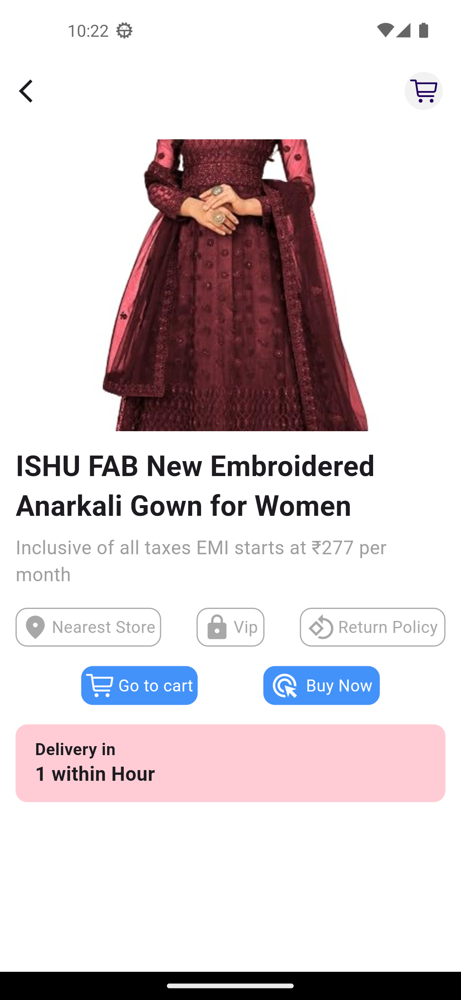

# Shopping App

## Overview

A Flutter-based ecommerce application designed to provide users with a smooth and enjoyable experience,This cross-platform app delivers a user-friendly interface with well-organized categories,The app supports multiple authentication methods.

## Features

- **User Authentication**:
  - Implemented Firebase.
  - Supports multiple authentication types:
    - Facebook authentication.
    - Email OTP authentication.
    - Google authentication.
    - Github authentication.

- **Backend Data**:
  - Backend data is managed using Firebase Firestore.
  - Pagination support for efficiently loading large event lists.    

- **State Management**:
  - Managed application state using the **BLoC** pattern.    
  
- **Reactive Programming**:
  - Utilized the **dart_either** package for handling results and errors in a more functional programming style.

## Technologies Used

- **Flutter** for building the cross-platform user interface.
- **Dart** for programming logic and functionality.
- **BLoC** for state management and handling complex application states.
- **JWT (JSON Web Tokens)** for secure authentication.
- **dart_either** for reactive programming and managing results and errors.
- **BLoC architecture** The BLoC architecture promotes separation of concerns, where business logic is decoupled from the UI layer, ensuring a clean, maintainable, and scalable application.

## UI Screenshots

| Splash Screen | Onboarding Screen |
|:--------------:|:-----------------:|
|  |  |

| SignIn Screen | SignUp Screen | Forgot Password |
|:--------------:|:-------------:|:---------------:|
|  |  |  |

| Home Screen | Product Details Screen | Categories Data |
|:------------:|:----------------------:|:---------------:|
|  |  |  |

| Wishlist Screen | Profile Screen |
|:---------------:|:--------------:|
|  |  |


## Installation

To run this project locally:

1. Clone the repository:
   ```bash
   git clone https://github.com/Mohammedsajadvt/stylish.git
   ```
2. Navigate to the project directory:
   ```bash
   cd stylish
   ```
3. Install dependencies:
   ```bash
   flutter pub get
   ```
4. Run the project:
   ```bash
   flutter run
   ```

   
